

# job4j_dreamjob

Приложение - биржа работы.

В системе два типа пользователей: кандидаты и кадровики. Кандидаты могут публиковать резюме. Кадровики могут публиковать вакансии о работе.

Кандидаты могут откликнуться на вакансию. Кадровики могут пригласить на вакансию кандидата.

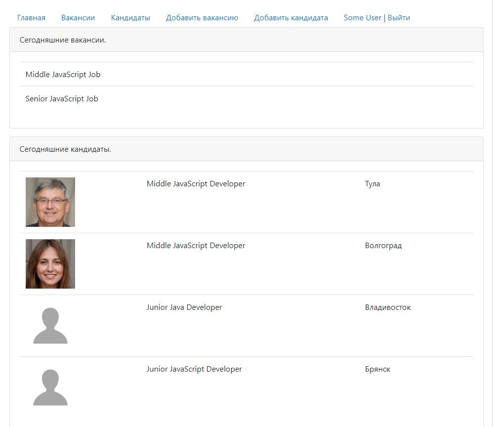

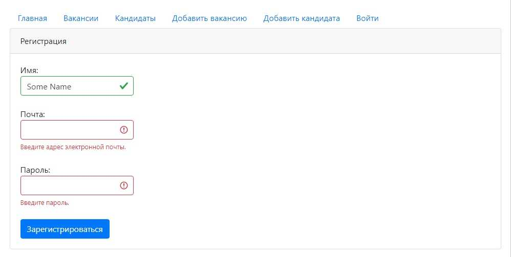

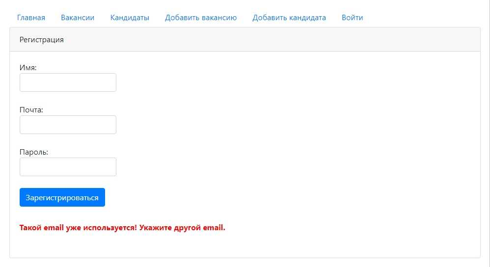

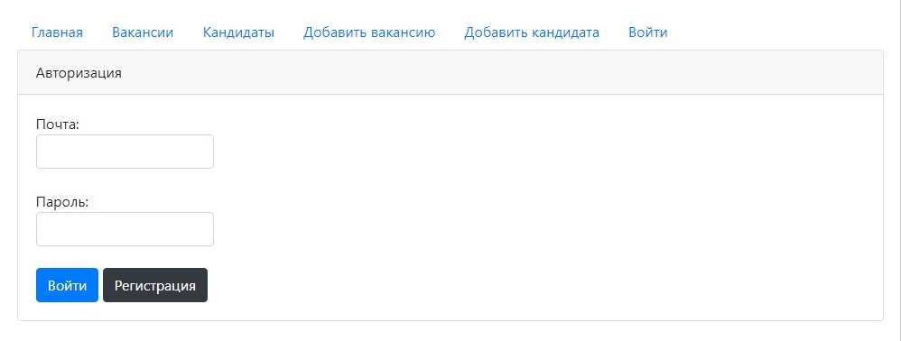

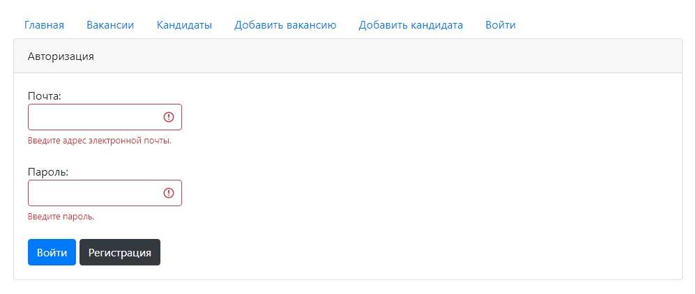

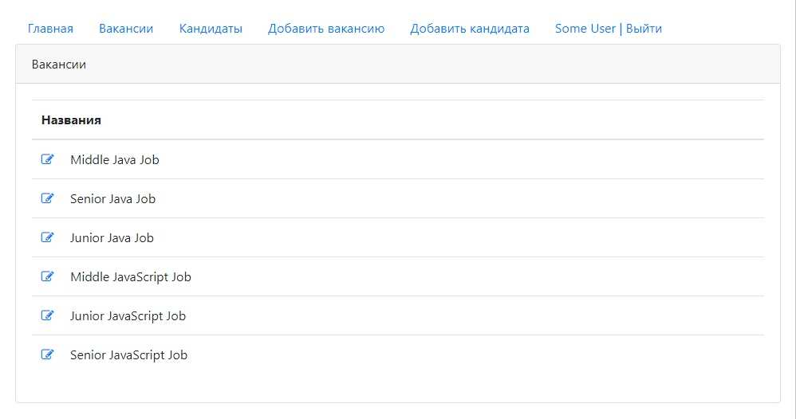

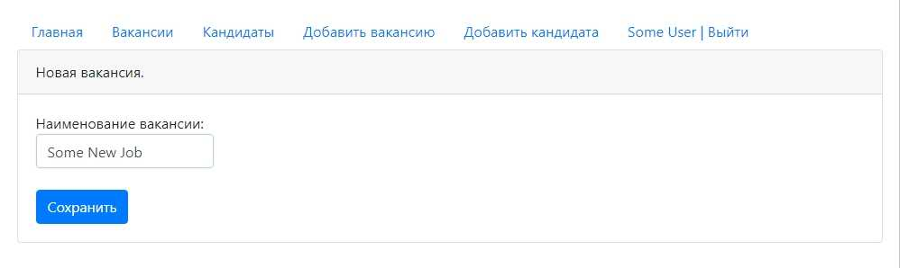

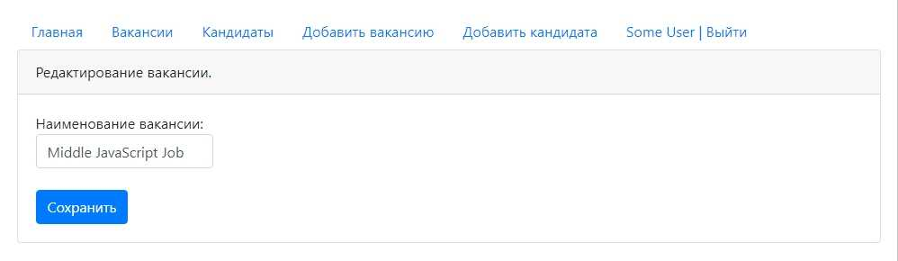

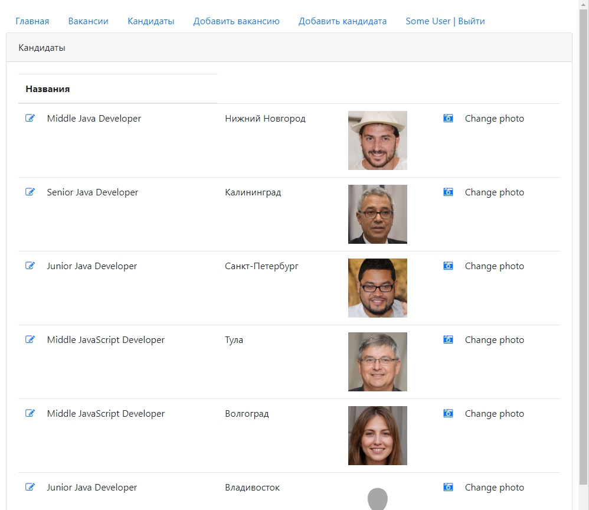

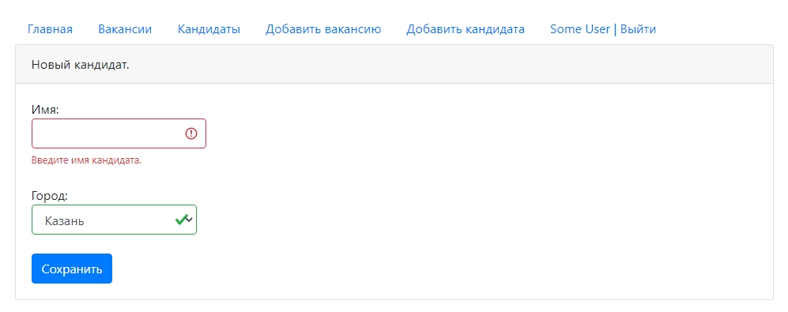

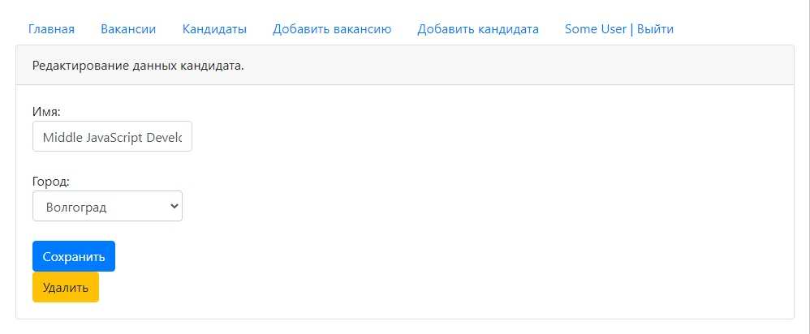

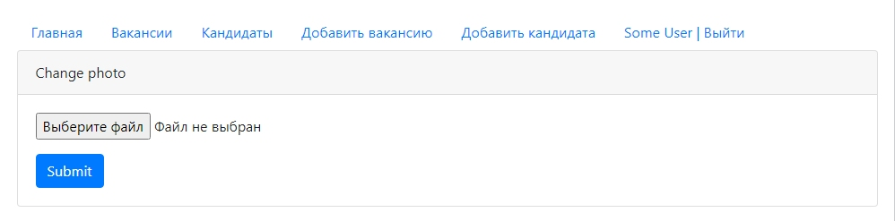
